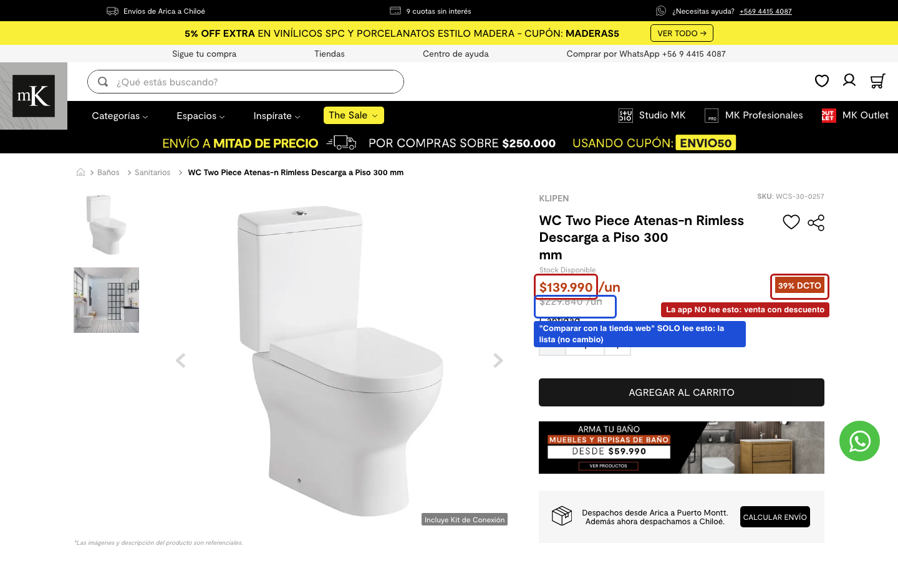
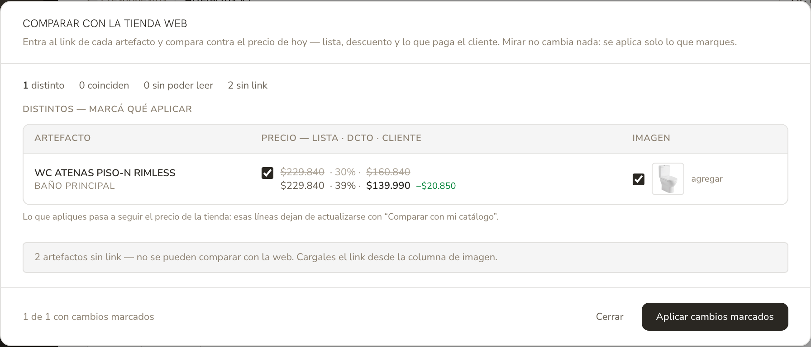

# Auditoría: sistema de precios de artefactos (julio 2026)

> **Estado al 2026-07-31, después de la auditoría**: los arreglos 1, 2, 3, 5 y 6
> están hechos en la rama `fix/precios-artefactos-web-dcto` (PR #357). El 4
> (limpiar los datos ya envenenados en la base viva) tiene el dry-run corrido y
> espera el OK de MJ producto por producto. Queda el 7 (links muertos). El
> cuerpo del informe se mantiene como se escribió — describe el sistema **como
> estaba** — y cada hallazgo arreglado lleva su nota.

**Fecha**: 2026-07-31 · **Alcance**: solo diagnóstico, no se cambió código ni datos.
**Disparador**: en el presupuesto nuevo (Casa Los Algarrobos), "Comparar con la tienda web" no trajo el precio real del WC ATENAS PISO-N RIMLESS — la app muestra 30% / $160.840 y la web de MK dice 39% / $139.990.

Verificación de base: se leyó la base VIVA (`ep-shy-morning`, marcador #64 = "Paseo del Sena" confirmado), solo lectura. Evidencia web: API pública de MK consultada el 2026-07-31.

---

## 1. El mapa: por dónde entra un precio a la app

Un precio de artefacto puede entrar o moverse por **cinco puertas**. Cada una lee y escribe cosas distintas — ahí nace la confusión.

| Puerta | Dónde está | Contra qué compara | Qué trae bien | Qué trae mal |
|---|---|---|---|---|
| **1. Crear producto pegando un link** | Catálogo → agregar (y también al agregar con link en una cotización) | La página de la tienda (lector genérico) | Nombre, marca, foto | **El precio de OFERTA queda guardado como si fuera la LISTA, con 0% de descuento** |
| **2. "Revisar precios"** | Catálogo | La tienda, por la vía buena (API de MK/LED Studio y de Kitchen House) | Lista Y descuento de hoy, los dos | Nada — es la única puerta que lee todo bien |
| **3. "Comparar con mi catálogo"** | Cotización | El catálogo BLARQ (no la web) | Lista + dcto + costo + foto del catálogo | Nada en sí — pero solo es tan fresco como esté el catálogo |
| **4. "Comparar con la tienda web"** | Cotización | La tienda, por la vía VIEJA (anterior al arreglo de descuentos) | La lista de hoy y la foto | **El descuento: lo descarta. Y en Kitchen House lee el precio de oferta como si fuera lista** |
| **5. Edición manual** | Cotización (celda por celda) | — | Lo que MJ escriba | Nada — pero "despega" la línea y ya nada la actualiza solo |

Y hay una sexta vía silenciosa: **"Traer de otra cotización"** refresca los precios automáticamente al copiar, usando la misma vía vieja de la puerta 4 (lista nueva × descuento viejo, sin mostrar nada).

### Cómo baja el precio del catálogo a las cotizaciones

- Al **agregar** un artefacto del catálogo, la cotización guarda una **foto** de lista + descuento de ese momento.
- Si después cambia el catálogo, el cambio **baja solo** a las cotizaciones en **borrador** cuyas líneas no estén "despegadas" (regla del ADR 2026-06-18). Las enviadas/aprobadas quedan congeladas.
- Una línea se **despega** (`priceOverridden`) cuando MJ la edita a mano **o cuando aplica "Comparar con la tienda web"** (a propósito: el precio pasó a venir de la tienda). Despegada = el catálogo nunca más la toca.

### Cuál conviene usar, hoy

El único circuito que funciona entero es: **catálogo → "Revisar precios" → aplicar**, y después en la cotización **"Comparar con mi catálogo" → aplicar**. Es un paso más largo, pero es el único camino donde el descuento de la web llega hasta la cotización. "Comparar con la tienda web" hoy sirve solo para detectar cambios de LISTA y fotos — no de descuento (detalle abajo).

---

## 2. El caso del WC Atenas, reconstruido

Datos leídos de la base viva y de la web el 2026-07-31:

| Dónde | Lista | Dcto | Precio cliente |
|---|---|---|---|
| Web MK hoy | $229.840 | **39,1%** | **$139.990** |
| Catálogo BLARQ (revisado por última vez el **14-07**) | $229.840 | 30,0% | $160.845 |
| Casa Los Algarrobos V1 (borrador, los 2 baños) | $229.840 | 30,0% | $160.840 |

Qué pasó, en orden:

1. El 14-07 se corrió "Revisar precios" en el catálogo. Ese día la web tenía 30% — el catálogo quedó **bien para ese día**.
2. MK subió la oferta a 39% en algún momento de estas dos semanas. **La lista no cambió** ($229.840); solo el descuento.
3. Al armar Casa Los Algarrobos, el WC bajó del catálogo con la foto del 14-07: 30% / $160.840. Correcto según el catálogo, viejo respecto de la web.
4. MJ apretó **"Comparar con la tienda web"**. Ese botón usa la vía vieja, que **solo lee el precio de LISTA** y tira a la basura el precio de oferta que la propia API de MK le entrega. Comparó $229.840 contra $229.840 → **"coincide"** → nada que aplicar. El 39% fue invisible.
5. Resultado: la cotización quedó con $160.840 mientras la web cobra $139.990 — **$20.850 de diferencia por unidad**, y el botón que debía detectarlo dijo que estaba todo bien.

**Y ojo con el escalón siguiente**: aunque la lista SÍ hubiera cambiado y MJ aplicara, el botón guarda la lista nueva y recalcula el precio a cliente **con el descuento viejo** de la línea. Nunca, en ningún caso, actualiza el descuento. Es un problema doble: no lo ve, y si viera, tampoco lo aplicaría.

Así queda el mismo caso **con el arreglo aplicado** (reproducido en la base de desarrollo con los valores exactos de la cotización real): el WC ya no cae en "coinciden" sino en "distintos", con el antes tachado arriba y el precio de la tienda abajo.

---

## 3. Hallazgos, del más grave al menor

### H0 — El botón roto no solo no detectaba: al aplicar SUBÍA el precio al cliente

> **Descubierto el 2026-07-31, después del arreglo**, porque MJ preguntó por qué había líneas marcadas como "editadas a mano" que ella nunca editó. Es el hallazgo más grave de la auditoría y explica el daño concreto que quedó en una cotización viva.

Cuando "Comparar con la tienda web" encontraba una diferencia de LISTA y MJ aplicaba, el botón guardaba la lista nueva y recalculaba lo que paga el cliente **con el descuento viejo de la línea**. Si esa línea tenía 0% (lo normal en los productos que habían entrado por link, ver H2), el cliente pasaba a pagar **la lista completa, sin descuento** — más caro que antes de apretar el botón. Y como el guardado va por el PUT por-ítem, la línea quedaba además **despegada**: el catálogo no la volvía a corregir nunca.

Los dos bugs se potencian: H2 sembraba el catálogo con la oferta guardada como lista (precio bajo, 0%), la web tenía la lista real (precio alto), el botón veía "la lista cambió", ofrecía el cambio, y al aplicarlo dejaba al cliente pagando el precio alto sin el descuento.

**Daño real encontrado en la base viva**, todo en Casa Los Algarrobos V1 (la cotización que MJ estaba armando):

| Artefacto | Quedó en | La tienda cobra | De más |
|---|---|---|---|
| WC ATENAS A PISO 210 MM | $235.340 | $144.350 (38,7% off) | **$90.990** |
| LAVAMANOS TRANI ORGÁNICO 40 CM | $308.190 | $254.990 (17,3% off) | **$53.200** |
| PERCHA ATLAS SIMPLE | $15.790 | $10.990 (30,4% off) | **$4.800** |

**$148.990 de más** en una sola cotización. La firma es reconocible y se puede volver a buscar con `scripts/diag-audit-lineas-despegadas.ts`: línea despegada, 0% de descuento guardado, y precio al cliente exactamente igual a la LISTA de la web mientras la web sí tiene descuento. Ese precio de lista ($235.340) solo lo pudo escribir este botón — es un dato que únicamente entrega la API de la tienda, no el scraper.

Con el arreglo, aplicar baja lista + descuento juntos, así que el precio al cliente termina siendo el de la tienda. Las tres líneas dañadas se corrigen abriendo el modal y marcándolas.

**De paso**: el aviso de esas filas decía *"Precio editado a mano"*, que es justo lo que hizo dudar a MJ. La app no puede saber por qué una línea se despegó (¿la editó ella?, ¿la despegó este botón?), así que el texto ahora describe el estado — "Este precio no sigue al catálogo" — en vez de afirmar una causa.

### H1 — "Comparar con la tienda web" es ciego al descuento (la causa del caso Atenas)

> **ARREGLADO** (2026-07-31). Toda la lectura de precios pasa ahora por un módulo único (`leerPrecioWeb`) que devuelve lista, precio de venta y descuento, y avisa si el descuento es confiable. El modal muestra los tres números y al aplicar bajan los tres. Verificado reproduciendo el caso: el WC pasa a "Distintos", muestra 30% → 39% y queda en $139.990.

La ruta de la cotización usa la librería vieja de revisión (`revisarArtefactos.ts`), anterior al arreglo de descuentos de junio. Esa librería pide el precio a la API de MK, recibe lista Y precio de oferta… y **conserva solo la lista**. Además **no conoce Kitchen House** (el arreglo del PR #296 se hizo solo en la ruta del catálogo), así que para KH cae al lector genérico, que devuelve **el precio de oferta como si fuera la lista**. Consecuencias:

- MK/LED Studio: cambios de descuento son invisibles (caso Atenas).
- Kitchen House: compara peras con manzanas — la lista guardada contra la oferta de la web. Si MJ aplica eso, guarda la oferta como lista y **encima** le resta el descuento viejo de la línea: **descuento doble**.
- "Traer de otra cotización" hereda todo esto en silencio (refresca precios al copiar usando la misma librería).

La ruta del catálogo ("Revisar precios") NO tiene este problema: ya lee lista + descuento por la vía correcta en las tres tiendas. El arreglo es hacer que la cotización use esa misma vía.

### H2 — Crear un producto pegando un link guarda la oferta como lista (0% de descuento)

> **ARREGLADO para lo que entre de acá en adelante** (2026-07-31): el autocompletar por link usa las APIs de precio y trae la lista real con su descuento. **Las entradas ya envenenadas siguen igual** — eso es el arreglo 4, que toca datos de la base viva y espera el OK de MJ.

El autocompletar de "agregar producto" (catálogo y cotización) usa solo el lector genérico de páginas, nunca las APIs de precio. El lector encuentra el precio de VENTA del día. Si el producto estaba en oferta, queda guardado como lista con 0%. Casos reales encontrados en la base viva (de 26 entradas con 0% y link a tienda con API):

- HORNO EMPOTRABLE 71 L: guardado $247.990 como lista — la web dice lista $519.990 con **52% de descuento**. (Es el caso del horno ya conocido, y sigue así.)
- GRIFERÍA URBAN-N ANTIQUE BRONZE: guardado $109.990 — web: lista $184.890, 40,5%.
- PERCHA ATLAS SIMPLE: guardado $10.990 — web: lista $15.790, 30,4%.
- WC ATENAS A PISO 210 MM (creado el 14-07): guardado $148.540 — web hoy: lista $235.340, venta $144.350 (38,7%). Este WC está en el borrador V3 de Paseo del Sena y también en Casa Los Algarrobos (despegado, $235.340).
- DOWNLIGHT LED STUDIO SLIM 10W: guardado $14.490 con 0% — web hoy tiene 13,8%.

El daño es doble: el margen aparente se distorsiona, y cuando después alguien corre "Revisar precios", el salto parece enorme (la "lista" pasa de $247.990 a $519.990) y asusta sin razón.

### H3 — El catálogo no avisa que está vencido

> **ARREGLADO** (2026-07-31): cada fila con link muestra "revisado hace X" bajo el precio de lista, en ámbar a partir de 30 días.

El descuento de una tienda cambia cuando la tienda quiere; el catálogo solo se actualiza cuando MJ corre "Revisar precios" a mano. Foto de hoy de las 136 entradas: **4 nunca revisadas, 18 revisadas hace ≤7 días, 74 entre 8 y 30 días, 40 hace más de 30 días**. La pantalla no muestra en ninguna parte "revisado hace X días", así que no hay forma de saber si el precio que se está cotizando es de ayer o de hace dos meses. El caso Atenas son solo 17 días de desfase.

### H4 — El campo "precio a cliente" del catálogo existe pero nadie lo lee

> **ARREGLADO** (2026-07-31): MJ decidió sacar el campo. Se quitó del código y del schema, y se corrigió el comentario que afirmaba lo contrario de lo que hacía el código. Los 53 valores quedaron respaldados en `backups/` antes del DROP, que se corre **después** del deploy (`scripts/sql/2026-07-31-drop-artefacto-catalog-clientprice.sql`).

El rediseño de junio dejó en el catálogo un campo de precio a cliente explícito (para cuando MJ "comparte" parte del descuento), y el comentario del esquema dice que el % de descuento quedó como legacy. **En la práctica es al revés**: todo — la pantalla del catálogo, el margen, el agregar a cotización, la bajada a borradores, "Comparar con mi catálogo" — calcula lista × (1 − dcto) e **ignora** ese campo. El formulario de edición ni siquiera lo manda al guardar. Hoy hay **53 de 136 entradas** con un precio a cliente guardado distinto del calculado; ninguno tiene efecto. No rompe nada por sí solo, pero es una mina: si algún flujo futuro empieza a leerlo, 53 productos cambian de precio de golpe.

### H5 — Menores / deuda que conviene conocer

- **"Comparar con la tienda web" despega la línea al aplicar.** Es una decisión de diseño (el precio pasa a venir de la tienda), no un bug — pero combinada con H1 significa que aplicar desde ahí deja la línea con descuento viejo Y despegada, o sea que el catálogo tampoco la corrige después. El arreglo de H1 debería repensar si despegar sigue siendo lo correcto cuando lo aplicado es exactamente lista+dcto de la web.
- **3 links muertos o cambiados** en el catálogo que "Revisar precios" no puede leer (MAMPARA CORREDERA 130CM, GRIFO ARES ARK 938, DESAGÜE ANTIQUE BRONZE 60CM). Aparecen como "sin lectura" en cada revisión.
- **byp.cl (2 productos) y las entradas sin link (11)** quedan siempre fuera de toda revisión automática.
- En toda la base hay hoy 97 líneas de artefactos en cotizaciones en borrador; **24 están despegadas** — esas no las actualiza nada salvo edición manual. No es un problema en sí, pero explica por qué a veces "actualizar" parece no hacer nada.

---

## 4. Qué conviene arreglar, en orden

Cada punto es candidato a un pendiente separado. Ninguno está hecho.

1. ~~**[H1] Que "Comparar con la tienda web" lea y aplique el descuento.**~~ **HECHO 2026-07-31.** Cambiar la ruta de la cotización para que use la misma lectura que ya usa el catálogo (APIs de MK/LED/KH con lista + descuento), mostrar la columna de descuento en el modal, y al aplicar guardar lista + dcto + precio recalculado. Arregla el caso Atenas y el riesgo de descuento doble con Kitchen House. Es el arreglo con mejor relación costo/beneficio: la lectura buena ya existe, hay que enchufarla acá.
2. ~~**[H1b] "Traer de otra cotización" con la misma lectura buena.**~~ **HECHO 2026-07-31.** Mismo cambio de librería; hoy mete precios mal calculados sin que se vea.
3. ~~**[H2] Que el autocompletar por link use las APIs de precio.**~~ **HECHO 2026-07-31.** Al crear producto (catálogo o cotización) con link de MK/LED/KH, traer lista + descuento reales en vez del precio del día como lista. Deja de sembrar entradas envenenadas.
4. **[H2-datos] Limpieza puntual de las entradas ya envenenadas.** *(DRY-RUN CORRIDO, espera el OK de MJ.)* `scripts/fix-catalogo-lista-vs-oferta.ts` recorre las 26 candidatas y las separa en dos grupos según el criterio de junio (`fix-catalogo-dcto-seguro.ts`):

   - **3 seguros** — el precio al cliente NO se mueve, solo se separa bien lista y descuento: HORNO EMPOTRABLE 71 L ($247.990 → lista $519.990 · 52,3%), PERCHA ATLAS SIMPLE ($10.990 → $15.790 · 30,4%), GRIFERÍA URBAN-N ANTIQUE BRONZE ($109.990 → $184.890 · 40,5%).
   - **2 que SÍ moverían el precio al cliente** y por eso no se tocan solos: DOWNLIGHT LED STUDIO SLIM ($14.490 → $12.490, −$2.000) y WC ATENAS A PISO 210 MM ($148.540 → $144.350, −$4.190). Acá el precio de la tienda cambió desde que se cargó, así que corregirlo es una decisión de negocio, no una limpieza de datos.
   - 18 sin cambio (la web no tiene descuento hoy) y 3 con el link roto.

   El script corre en dry-run por defecto; para escribir hace falta `--aplicar --si-la-viva`.
5. ~~**[H3] Mostrar la edad del precio.**~~ **HECHO 2026-07-31** (la marca por fila; la revisión automática periódica sigue sin hacerse). Columna o pastilla "revisado hace X días" en el catálogo (el dato ya está guardado, solo no se muestra), y quizás el mismo aviso dentro de "Comparar con mi catálogo". Alternativa más ambiciosa: revisión automática periódica — pero solo el aviso ya evita cotizar con precios de hace un mes sin saberlo.
6. ~~**[H4] Decidir qué hacer con el "precio a cliente" del catálogo.**~~ **HECHO 2026-07-31 — MJ eligió borrarlo.** Las dos salidas eran borrarlo (y dejar claro que el precio va por lista × dcto, que es lo que el código hace de verdad) o implementarlo en serio; lo peor era el estado intermedio, con 53 valores guardados que no hacían nada y podían activarse solos si algún flujo futuro los leía. Se quitó del código y del schema, con el comentario corregido; el DROP en la viva va después del deploy y los valores quedaron respaldados.
7. **[H5] Higiene** *(PENDIENTE, salvo lo de las tiendas sin API, que ya quedó cubierto: ahora vienen marcadas y aplicar no les manda el descuento a 0.)*: arreglar los 3 links muertos, decidir si byp.cl merece lector propio, y evaluar un indicador visual de "línea despegada" en el editor (deuda declarada del ADR de junio que sigue pendiente).

---

## 5. Cómo se verificó (para poder repetirlo)

- Scripts de solo lectura en `scripts/` de esta rama: `diag-audit-atenas.ts` (caso puntual), `diag-audit-catalogo-global.ts` (panorama), `diag-audit-dcto-cero-vs-web.ts` (candidatas con 0% contra la web de hoy), `diag-audit-captura-mk.ts` (captura anotada). Todos leen el `DATABASE_URL` directo de `.env.prod` (sin dotenv, por el gotcha de la base equivocada) e imprimen el host.
- Código leído: `fetchVtexPrice.ts`, `fetchShopifyPrice.ts`, `fetchArtefactoData.ts`, `revisarArtefactos.ts`, `syncArtefactos.ts`, las rutas `revisar-precios` (catálogo y presupuesto), `actualizar-catalogo`, el PUT por ítem, los dos `extract`, `importar-de`, `ArtefactosCatalogClient.tsx`, `ArtefactosEditor.tsx`, `RevisarPreciosArtefactos.tsx`, y el ADR `2026-06-18-artefactos-precios-catalogo-a-cotizacion.md`.
